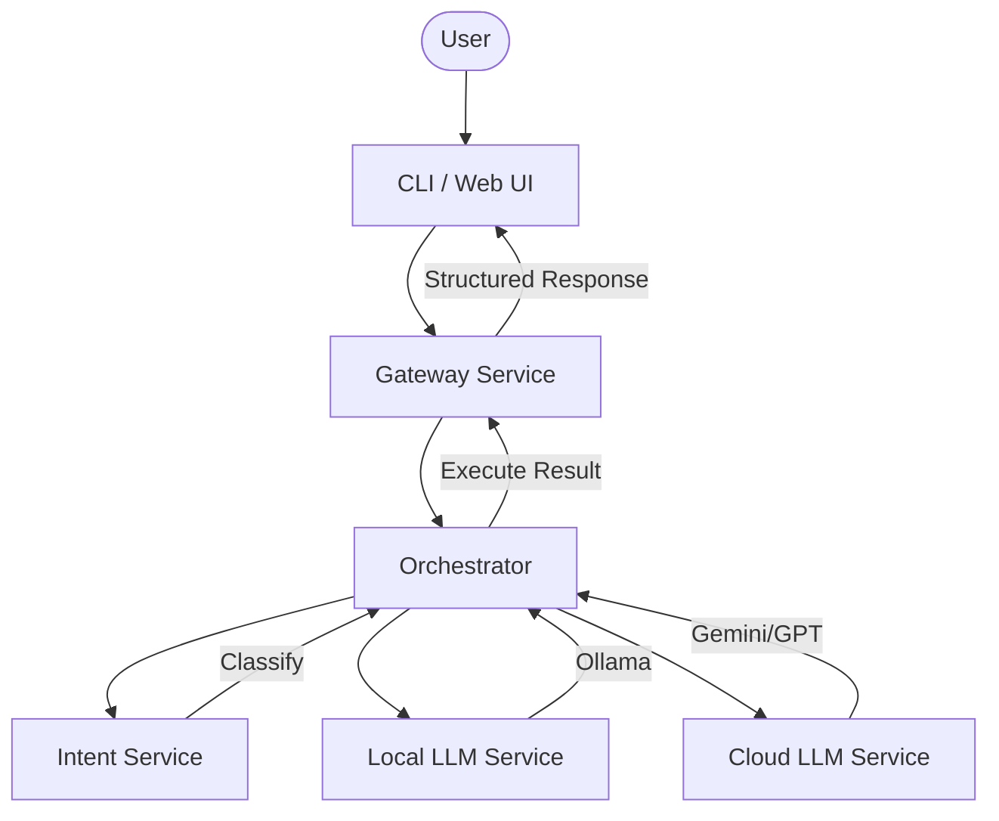

# 🚀 HAR — Hybrid AI Router

> An intelligent routing engine that decides when to use local models, cloud models, or both.

HAR is a developer-first control layer for LLM execution. It analyzes the intent and complexity of your prompts to select the most efficient path—saving costs, protecting privacy, and ensuring your application stays online even when cloud providers fail.

### How it Works


---

## 💡 Why HAR?

Not every prompt needs a trillion-parameter cloud model. Using the right tool for the job leads to better systems:

| Feature | Local LLM | Cloud LLM | **HAR (Hybrid)** |
| :--- | :--- | :--- | :--- |
| **Cost** | Free (Your hardware) | High (Usage-based) | **Optimized** |
| **Privacy** | Maximum (Data stays local) | Variable (External API) | **Privacy-Aware** |
| **Speed** | Low Latency (Local) | Higher Latency (Network) | **Balanced** |
| **Reliability** | Works Offline | Fragile (Network/Outages) | **Automatic Fallback** |

---

## ✨ Features

- **Smart Routing**: Categorizes prompts (e.g., chat, architecture, sensitive) to choose the best model.
- **Hybrid Execution**: Performs local pre-processing (cleanup/summarization) before sending refined context to the cloud.
- **Resilience First**: Built-in timeouts, retries, and automatic local fallback if cloud keys or networks fail.
- **Explainable AI**: Transparent "Execution Trace" that tells you *why* a specific route was chosen using deterministic logic.
- **CLI-First DX**: A polished terminal interface with structured output, JSON support, and system diagnostics.
- **Security Hardened**: Protected via API keys, rate limiting, and automated secret scanning.
- **Production Ready**: Includes CI/CD pipelines, regression tests, and evaluation benchmarks.

---

## 🛡️ Trust & Security

HAR is built with a **Security-First** philosophy, ensuring your data is handled with maximum care:

- **Strict Privacy Mode**: When `PRIVACY_MODE=strict`, prompts detected as sensitive are **physically blocked** from ever touching a cloud provider. Hybrid execution and cloud fallbacks are disabled for these payloads.
- **Deterministic Redaction**: Uses high-performance regex patterns to redact Emails, Phone Numbers, API Keys, and Secrets *before* they are sent to any cloud step.
- **Rate Limiting**: Built-in protection against request floods using an in-memory window-based limiter at the Gateway.
- **Secret Scanning**: Automated CI checks ensure no credentials or sensitive patterns are committed to the codebase.

---

## ⏱️ Quick Start (5 Minutes)

HAR is designed to work out of the box with [Ollama](https://ollama.ai/).

### 1. Install & Run Ollama
Download Ollama from [ollama.com](https://ollama.com/) and pull a supported model:
```bash
ollama run llama3.2
```

### 2. Setup HAR
Clone the repository and install dependencies:
```bash
git clone https://github.com/FarhanS7/Hybrid-Router.git
cd Hybrid-Router
npm install
npm run build
```

### 3. Verify Routing
Run the built-in regression tests to ensure the routing engine is working correctly:
```bash
npm run test:routing
```

### 4. Setup CLI
Choose one of the following methods to run the `har` command:

**Option A: Link Globally (Recommended)**
```bash
npm link --workspace apps/cli
har doctor
```

**Option B: No-link usage**
```bash
npm run cli -- doctor
```

### 5. Configure Environment
Copy the example environment file:
```bash
cp .env.example .env
```
Open `.env` and set your local model (e.g., `OLLAMA_MODEL=llama3.2`). 

---

## 🧪 Testing & Evaluation

HAR includes a professional suite for measuring routing performance:

```bash
# Run regression tests (19+ cases)
npm run test:routing

# Run evaluation benchmark (Accuracy, Safety, Latency)
npm run eval:routing
```

---

## ⚙️ Configuration

Key settings in `.env`:
- `APP_API_KEY`: Secure key for CLI-to-Gateway communication.
- `PRIVACY_MODE`: `strict` (No cloud for sensitive) or `balanced` (Redaction-based).
- `RATE_LIMIT_MAX_REQUESTS`: Max requests per minute (Default: 60).
- `OLLAMA_BASE_URL`: Usually `http://localhost:11434`
- `LOCAL_MODEL`: Your preferred local model (e.g., `llama3.2`, `phi3`)
- `CLOUD_API_KEY`: Required for cloud routing (e.g., Gemini or OpenAI)
- `MAX_PROMPT_CHARS`: Maximum prompt length (default: 12000)

---

## 🏗️ Project Structure

```text
apps/
  cli/             # Main developer interface
  web/             # Web dashboard (Experimental)

services/
  gateway/         # Entry point for all requests + Rate Limiting
  orchestrator/    # Routing logic, Privacy layer & LangGraph state machine
  intent-service/  # Prompt classification engine
  local-llm/       # Ollama provider bridge
  cloud-llm/       # Gemini/OpenAI provider bridge

packages/
  shared/          # Common types & response contracts
  config/          # Environment & policy management
  logger/          # Structured logging (Pino)

scripts/           # Testing, Evaluation, and Secret Scanning
```

---

## 🗺️ Roadmap & Status

### **Completed (V1.0)**
- ✅ Core Routing & Intent Detection
- ✅ Multi-Service Orchestration (LangGraph)
- ✅ Hybrid Execution (Local → Cloud)
- ✅ Explainable Routing Reasons
- ✅ CLI with Verbose/JSON modes
- ✅ Health Check Diagnostics (`har doctor`)
- ✅ Security Hardening (API Key + Rate Limiting)
- ✅ **Strict Privacy Mode & Redaction**
- ✅ **CI/CD & Evaluation Framework**

### **Planned**
- 🛠️ Adaptive Learning (Routing based on previous performance)
- 🛠️ More Providers (Anthropic, Mistral, Local vLLM)
- 🛠️ Web-based Analytics Dashboard
- 🛠️ Prompt Injection Protection Layer

---

## 🤝 Contributing

We welcome contributions! Whether it's adding a new provider, improving routing logic, or fixing a typo in the docs:
1. Fork the repo.
2. Create a feature branch.
3. Submit a Pull Request.

---

## 🧠 Philosophy

> Not every problem needs the most powerful model; every problem needs the most efficient solution.